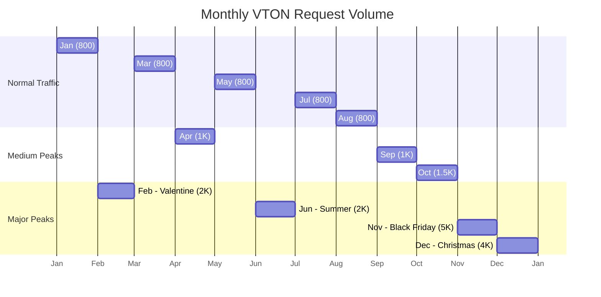

# GPU Cost & Scalability Study for Fashion-Insta Virtual Try-On

## Traffic Model

| Metric | Value |
|--------|-------|
| Total Annual Visitors | 400,000 |
| Regular Customers (~5%) | 20,000 |
| Casual Visitors | 380,000 |
| Expected VTON Inferences/Year | ~389,000 |
| Target Latency | 3-5 seconds |

## Model Requirements

| Model | Role | Parameters | VRAM (Inference) |
|-------|------|------------|------------------|
| Marqo FashionSigLIP | Embedder image + texte | 200M | ~1-2 GB |
| fashn-ai/fashn-vton-1.5 | Virtual Try-On | 972M | ~8-10 GB |
| **Total** | | ~1.2B | **~9-12 GB** |

Le passage de DINOv3 (840M, ~4-5 GB) à Marqo FashionSigLIP (200M, ~1-2 GB) réduit le VRAM requis de ~14-15 GB à ~9-12 GB.
**T4 (16 GB) devient pleinement viable** ; L4 (24 GB) offre désormais un headroom confortable.

## Concurrent Load Analysis

### Normal Operations
- **Daily Requests**: ~1,065
- **Concurrent Requests**: 1-2
- **GPU Requirement**: 1x L4/T4 sufficient

### Peak Periods (Black Friday, Christmas)
- **Daily Requests**: ~5,000 (Nov), ~4,000 (Dec)
- **Concurrent Requests**: 5-10
- **GPU Requirement**: 1x L4 handles peak with 3-5s latency

## GPU Sizing Options (Azure + Alternatives)

### Azure GPU Availability

| GPU | Specs | Azure Instance | On-Demand/hr | Notes |
|-----|-------|----------------|--------------|-------|
| GB200 | 4x192GB, ~9 TB/s | ND-GB200-v6 | Sur devis | Entreprise uniquement |
| B200 | 180GB, 8 TB/s | ❌ Non dispo | - | Cloud tiers seulement |
| B100 | 192GB, 8 TB/s | ❌ Non dispo | - | Cloud tiers seulement |
| L40S | 48GB, 864 GB/s, 733 TFLOPS | ND* series | ~$0.80-1.00 | Pas de pricing public clair |
| **L4** | 24GB, 300 GB/s, 242 TFLOPS | Standard_NVads_L4s_v5 | **$0.39-0.50** | ✓ Recommandé |
| A10 | 24GB, ~300 GB/s, 250 TFLOPS | Standard_NVads_A10_v5 | $0.45-0.91 | ✓ Option valide |
| T4 | 16GB, 320 GB/s, 130 TFLOPS | Standard_NC*as_T4_v3 | $0.53-0.75 | Legacy mais fonctionnel |
| A100 | 80GB, 2 TB/s, 624 TFLOPS | Standard_NC*ads_A100_v4 | $3.40-3.67 | Overkill |
| H100 | 80GB, 3.3 TB/s, 1,513 TFLOPS | Standard_ND*sr_H100_v5 | $12.29 | Massive overkill |

### Comparatif Performance/Coût (inférence)

| GPU | Specs Techniques | VRAM | $/hr | $/TFLOPS | Concurrent | Verdict |
|-----|------------------|------|------|----------|------------|---------|
| **L4** | 300 GB/s, 242 TFLOPS FP8, 72W | 24GB | $0.45 | 0.002 | 3-5 | **★ Meilleur choix** |
| A10 | ~300 GB/s, 250 TFLOPS FP16, 150W | 24GB | $0.65 | 0.003 | 3-5 | Bon alternative |
| T4 | 320 GB/s, 130 TFLOPS FP16, 65W | 16GB | $0.60 | 0.005 | 2-3 | Suffisant |
| L40S | 864 GB/s, 733 TFLOPS FP16, 350W | 48GB | $0.90 | 0.001 | 5-8 | Plus performant mais plus cher |
| A100 | 2,039 GB/s, 624 TFLOPS FP16, 400W | 80GB | $3.50 | 0.006 | 5-8 | Overkill |
| H100 | 3,300 GB/s, 1,513 TFLOPS FP8, 700W | 80GB | $12.29 | 0.008 | 10-15 | Massive overkill |

> **L4 offre le meilleur équilibre** performance/prix pour notre workload (~9-12GB VRAM, 3-5s latence). T4 viable pour les charges normales.

## Annual Peak Traffic Distribution

## Monthly Request Breakdown

| Month | Event | Est. Daily Requests | Peak Concurrent |
|-------|-------|---------------------|-----------------|
| Jan | New Year | 800 | 1-2 |
| Feb | Valentine's | 2,000 | 3-4 |
| Mar | Normal | 800 | 1-2 |
| Apr | Normal | 1,000 | 1-2 |
| May | Normal | 800 | 1-2 |
| Jun | Summer Sale | 2,000 | 3-4 |
| Jul | Normal | 800 | 1-2 |
| Aug | Normal | 800 | 1-2 |
| Sep | Normal | 1,000 | 1-2 |
| Oct | Pre-Holiday | 1,500 | 2-3 |
| Nov | Black Friday | 5,000 | 5-8 |
| Dec | Christmas | 4,000 | 4-6 |

## Annual Cost Comparison (400k Users)

| Service | Annual Estimate |
|---------|-----------------|
| **Azure L4 (on-demand)** | **$3,150-4,380** |
| Azure L4 (reserved/savings plan) | $2,600-3,200 |
| Azure A10 (on-demand) | $3,500-7,000 |
| Azure T4 (on-demand) | $3,900-4,800 |
| L40S (cloud tiers) | $5,000-7,000 |
| Cloud API (FASHN + Replicate) | ~$29,175 |
| Azure A100 | ~$15,000+ |
| Azure H100 | ~$65,000+ |

### Notes
- **B100/B200/GB200** : Pas disponibles sur Azure (réservés aux cloud providers tiers type CoreWeave, Lambda, RunPod)
- **L40S** : Pricing Azure pas clair, disponible sur cloud alternatifs à ~$0.80-1.00/hr
- L4 reste le meilleur choix pour Azure avec pricing transparent et performant

### Assumptions
- 10% conversion rate to VTON feature
- 2 items tried per session
- Marqo FashionSigLIP : auto-hébergé (inclus dans le coût GPU)
- FASHN API: $0.075/img
- Azure L4: $0.45/hr on-demand
- VRAM requis pour notre pipeline: ~9-12GB (Marqo ~1-2GB + fashn-vton-1.5 8-10GB)

## Performance sous Charge

### Métriques estimées par GPU (batch_size=1, inference unique)

| GPU | Temps inférence | Throughput | VRAM utilisée | Latence |
|-----|-----------------|------------|---------------|---------|
| **T4** | 4-6s | 0.17-0.25/s | ~10GB | ✓ <7s (viable) |
| **L4** | 3-4s | 0.25-0.33/s | ~10GB | ✓ <5s |
| A10 | 3-4s | 0.25-0.33/s | ~10GB | ✓ <5s |
| L40S | 2-3s | 0.33-0.50/s | ~10GB | ✓ Excellent |
| A100 | 2-3s | 0.33-0.50/s | ~10GB | ✓ Overkill |
| H100 | 1-2s | 0.50-1.00/s | ~10GB | ✓ Massive overkill |

### Charge Concurrente

| GPU | 1 req | 3 req | 5 req | 8 req | 10 req |
|-----|-------|-------|-------|-------|--------|
| **T4** | 4s | 6s | 8-10s* | - | - |
| **L4** | 3s | 4s | 5-6s | 8-10s* | timeout* |
| A10 | 3s | 4s | 5-6s | 8-10s* | timeout* |
| L40S | 2s | 3s | 4s | 5-6s | 7-8s |

*Temps dépasse notre target 5s

**Conclusion** : Avec ~10 GB VRAM requis (vs ~14 GB avec DINOv3), le T4 (16 GB) est désormais viable pour les charges normales. Le L4 reste le meilleur choix pour les pics (Black Friday, 5-8 concurrent).

## Scalability Strategy

### Baseline (Jan-Oct)
- 1x L4 running continuously
- Handles normal traffic with headroom
- Cost: ~$300-360/month

### Peak Season (Nov-Dec)
- L4 handles 5-8 concurrent — sufficient for Black Friday
- Optional: Scale to 2x L4 only during peak week
- Additional cost: ~$300-360/month for second instance
- Total peak month cost: ~$600-720/month

### Cost Optimization
1. **Use L4 (not H100/A100)**: Save 80-95% vs flagship GPUs
2. **Reserved instances**: ~20-30% further savings
3. **Request queuing**: Smooth out traffic spikes
4. **Cache popular items**: Reduce VTON generation for repeat items

## Résumé des GPUs Azure

| GPU | Disponibilité Azure | VRAM | Prix/heure | Notre verdict |
|-----|---------------------|------|------------|---------------|
| GB200 | ND-GB200-v6 | 4x192GB | Sur devis | ❌ Trop cher, overkill |
| B200 | ❌ Non | 180GB | - | ❌ Pas Azure |
| B100 | ❌ Non | 192GB | - | ❌ Pas Azure |
| L40S | ~$0.80-1.00* | 48GB | ~$0.90 | ⚠️ Pricing flou |
| **L4** | ✓ Standard_NVads_L4s_v5 | 24GB | **$0.39-0.50** | **✓ Recommandé** |
| A10 | ✓ Standard_NVads_A10_v5 | 24GB | $0.45-0.91 | ✓ Bon choix |
| T4 | ✓ Standard_NC*as_T4_v3 | 16GB | $0.53-0.75 | ⚠️ Legacy |

*Prix approximatifs, pas de pricing public officiel sur Azure

## Recommandation Finale

Pour Fashion-Insta avec 400k visiteurs annuels :

1. **Primary** : Azure L4 (~$300-360/mois = **$3,600/an**)
2. **Backup** : A10 si L4 indisponible
3. **Peak Season** : Ajouter 2e instance uniquement Nov-Dec (+$360/mois temporaire)

**Économies** : ~$3,600/an vs $65,000/an avec H100 = **18x moins cher**

---

## Notes — Scaling & Parallélisme GPU

### Contention GPU : Embedding vs VTO

Les deux workloads partagent le même GPU L4/T4 mais ont des profils très différents :

| Workload | Temps | VRAM | Profil |
|----------|-------|------|--------|
| FashionSigLIP (query embedding) | ~50-200ms | ~1-2 GB | Rapide, fréquent |
| fashn-vton-1.5 (VTO inference) | ~10-20s | ~8-10 GB | Lent, occasionnel |

**Risque** : un VTO en cours monopolise ~10 GB VRAM pendant ~15s. Si une requête d'embedding arrive pendant ce temps, elle sera bloquée en attente ou partagera la mémoire restante (~6-14 GB selon le GPU).

**Mitigation recommandée** : utiliser une **queue séparée** (Azure Service Bus) devant le endpoint VTO. Les requêtes embedding peuvent être servies en parallèle via un thread séparé ou une instance légère CPU si nécessaire.

### Latence réelle du VTO

L'estimation "~5s" dans le diagramme est optimiste pour un Diffusion Transformer sur T4. Valeurs réalistes :

| GPU | Steps = 20 | Steps = 30 |
|-----|-----------|-----------|
| T4 (16 GB) | ~12-18s | ~18-25s |
| L4 (24 GB) | ~8-12s | ~12-16s |

À prendre en compte dans les SLA et le design UX (spinner, progress bar, async polling).

### Scalabilité horizontale

Le GPU cluster Azure ML (NC-series) peut scaler horizontalement :
- **Scale-out** : ajouter des instances à la demande (Black Friday, défilés, soldes)
- **Scale-in** : réduire à 0 instances hors heures de pointe (économies significatives)
- **Recommandation** : configurer un **autoscaler** sur le nombre de jobs en queue avec min=0, max=2 instances

### T4 vs L4 : décision finale

Avec ~9-12 GB VRAM requis pour les deux modèles simultanés :
- **T4 (16 GB)** : marge de ~4-7 GB — viable pour charges normales (1-2 concurrent), risque d'OOM si les deux modèles sont chargés simultanément à pleine capacité
- **L4 (24 GB)** : marge de ~12-15 GB — confortable, recommandé pour Black Friday (5-8 concurrent)

**Conseil pratique** : démarrer avec T4 en MVP/dev, migrer vers L4 dès que le trafic dépasse 2-3 req/min concurrents.