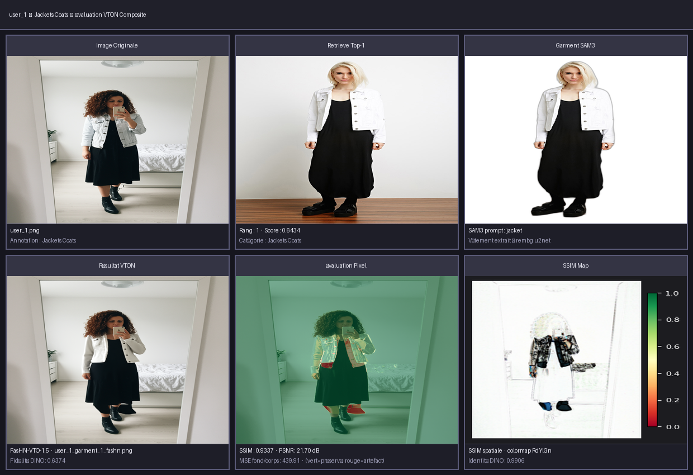
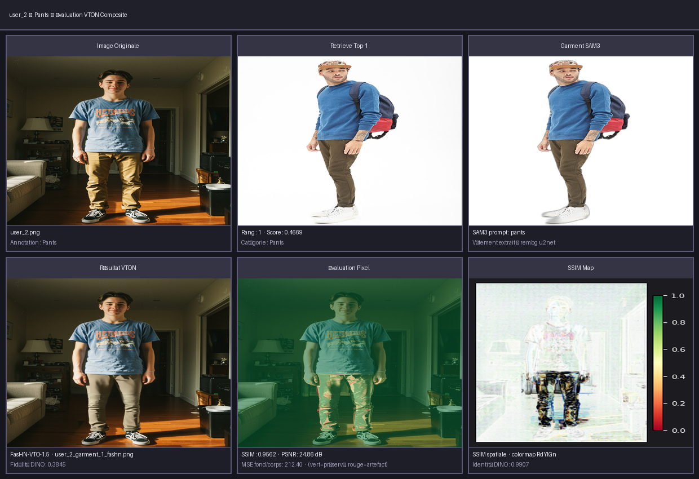
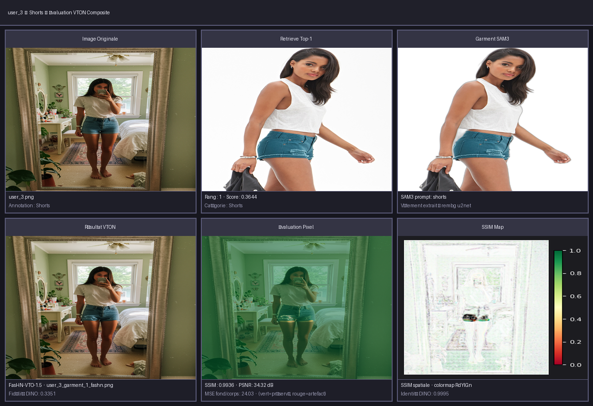
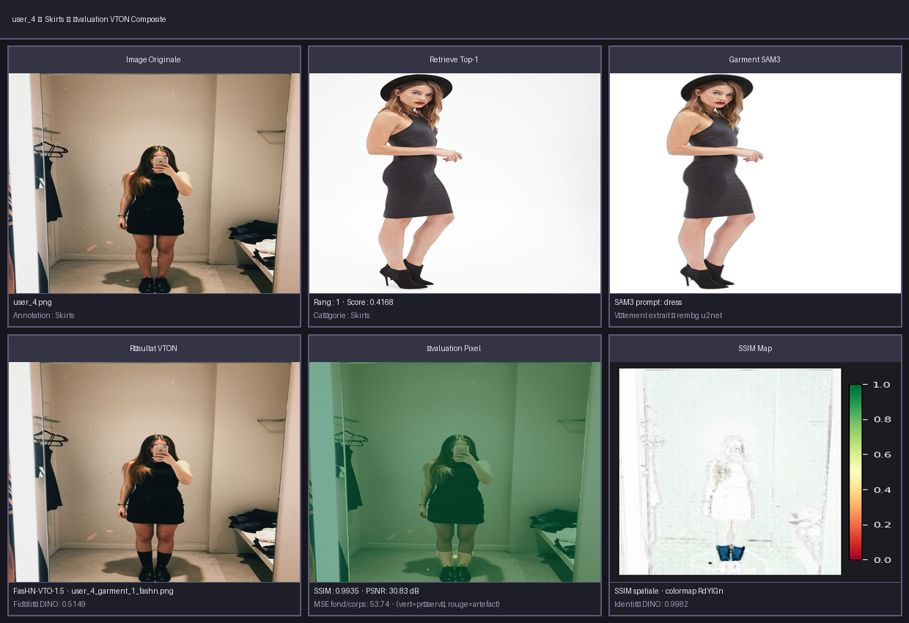
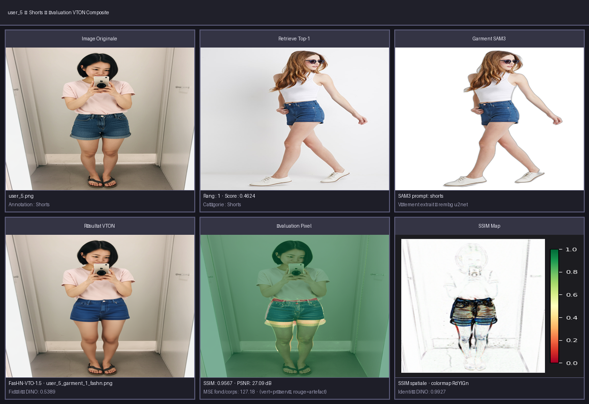
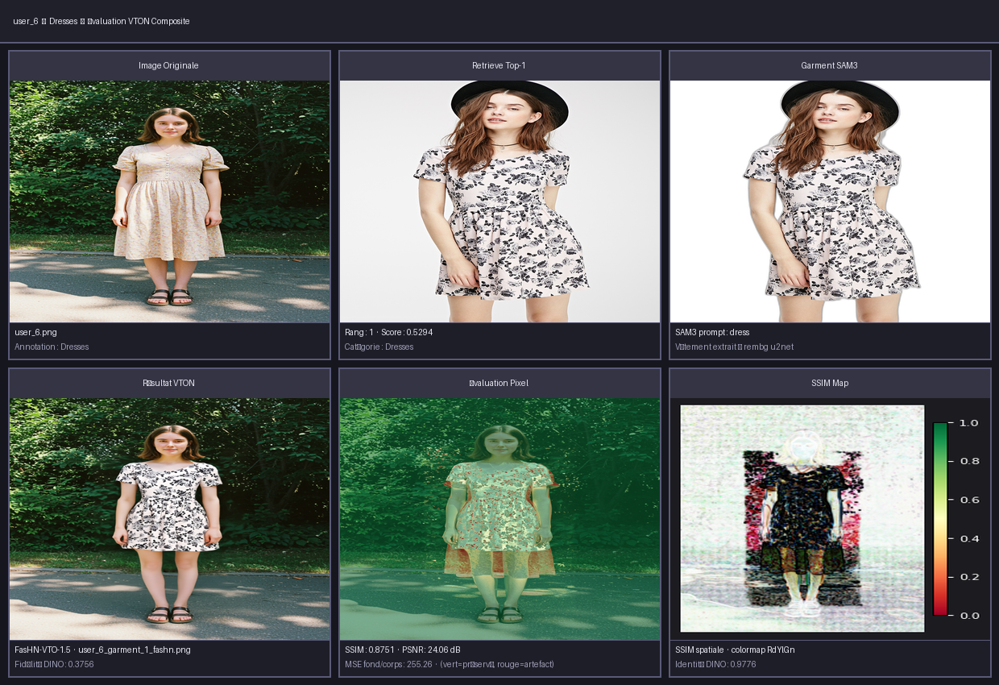

# Rapport d'évaluation VTON — FasHN-VTO-1.5

## Données utilisées

Ce rapport évalue les résultats de virtual try-on sur **6 utilisateurs démo** générés
via `generate_vto_report.py`. Chaque utilisateur est composé de :

| Élément | Description |
|---------|-------------|
| **Personne** | Photo originale de la personne (user_N.png) |
| **Vêtement source** | Vêtement flat-lay recommandé par Marqo FashionSigLIP (user_N_garment_1.jpg) |
| **Résultat VTON** | Image générée par FasHN-VTO-1.5 (user_N_garment_1_fashn.png) |

Il **n'existe pas de ground truth** (pas de photo réelle de la personne portant
ce vêtement exact). L'évaluation est donc adaptée en **single-reference settings** :

- La **personne originale** sert de référence pour la préservation du corps/visage/fond
- Le **vêtement source** sert de référence pour la fidélité de transfert

**6 échantillons** évalués — catégories : Dresses, Jackets Coats, Pants, Shorts, Skirts.

---

## Protocole d'évaluation

L'évaluation suit le protocole multi-modal **OpenVTON-Bench** (Li et al., 2025)
avec 3 niveaux de métriques :

| Niveau | Méthode | Ce que ça mesure |
|--------|---------|-----------------|
| **1 — Pixel** | SSIM / PSNR / MSE | Préservation fond/corps (région NON-vêtement) — triangulation person × result |
| **2 — Feature** | Cosine sim DINOv3 ViT-L/16 | Fidélité texture vêtement + préservation identité |
| **3 — VLM** | Qwen3-VL-4B-Instruct | Score sémantique sur 5 dimensions (1–5) |

Le bloc **OpenVTON-Bench** ajoute la segmentation SAM3 du vêtement + érosion multi-échelle
(40/80/120 px) pour isoler la texture interne des bords.

## Scores globaux

### Niveau 1 — Pixel (triangulation : fond/corps, hors vêtement)

| Métrique | Valeur |
|----------|------:|
| SSIM   | 0.9515 |
| PSNR   | 27.14 dB |
| MSE    | 185.42 |

### Niveau 2 — Feature (cosine sim DINOv3)

| Métrique | Valeur | Interprétation |
|----------|------:|----------------|
| Fidélité vêtement (source → résultat) | 0.4644 | Plus c'est proche de 1, mieux la texture est transférée |
| Préservation identité (personne → résultat) | 0.9916 | Plus c'est proche de 1, mieux le visage/corps sont conservés |

### Niveau 3 — VLM sémantique (Qwen3-VL-4B, 1–5)

| Dimension | Score |
|-----------|------:|
| Cohérence du fond            | 5.0 ★★★★★ |
| Préservation de l'identité   | 5.0 ★★★★★ |
| Score global                 | 4.3 ★★★★☆ |
| Plausibilité de la forme     | 4.3 ★★★★☆ |
| Fidélité de la texture       | 4.7 ★★★★☆ |

## Par catégorie

| Catégorie | n | SSIM | Fid. vet. | Identité | Cohérence du fond | Préservation de l'identité | Score global | Plausibilité de la forme | Fidélité de la texture |
|---:|---:|---:|---:|---:|---:|---:|---:|---:|---:|
| Dresses                      |   1 | 0.8751 | 0.3756 | 0.9776 | 5.0  | 5.0  | 4.0  | 4.0  | 4.0  |
| Jackets_Coats                |   1 | 0.9337 | 0.6374 | 0.9906 | 5.0  | 5.0  | 4.0  | 4.0  | 5.0  |
| Pants                        |   1 | 0.9562 | 0.3845 | 0.9907 | 5.0  | 5.0  | 3.0  | 3.0  | 4.0  |
| Shorts                       |   2 | 0.9752 | 0.4370 | 0.9961 | 5.0  | 5.0  | 5.0  | 5.0  | 5.0  |
| Skirts                       |   1 | 0.9935 | 0.5149 | 0.9982 | 5.0  | 5.0  | 5.0  | 5.0  | 5.0  |

## Par échantillon

| Échantillon | Catégorie | SSIM | Fid. vet. | Identité | Cohérence du fond | Préservation de l'identité | Score global | Plausibilité de la forme | Fidélité de la texture |
|---:|---:|---:|---:|---:|---:|---:|---:|---:|---:|
| user_1                       | Jackets Coats | 0.9337 | 0.6374 | 0.9906 | 5.0  | 5.0  | 4.0  | 4.0  | 5.0  |
| user_2                       | Pants         | 0.9562 | 0.3845 | 0.9907 | 5.0  | 5.0  | 3.0  | 3.0  | 4.0  |
| user_3                       | Shorts        | 0.9936 | 0.3351 | 0.9995 | 5.0  | 5.0  | 5.0  | 5.0  | 5.0  |
| user_4                       | Skirts        | 0.9935 | 0.5149 | 0.9982 | 5.0  | 5.0  | 5.0  | 5.0  | 5.0  |
| user_5                       | Shorts        | 0.9567 | 0.5389 | 0.9927 | 5.0  | 5.0  | 5.0  | 5.0  | 5.0  |
| user_6                       | Dresses       | 0.8751 | 0.3756 | 0.9776 | 5.0  | 5.0  | 4.0  | 4.0  | 4.0  |

## Visualisations — Échantillons

### user_1 — Jackets Coats

garment_idx: **6415** | category: **Jackets_Coats** | SAM3: **jacket** | retrieval: **0.6434** | fidelity: **0.6374**

|  |

### user_2 — Pants

garment_idx: **38** | category: **Denim** | SAM3: **pants** | retrieval: **0.4669** | fidelity: **0.3845**

|  |

### user_3 — Shorts

garment_idx: **4099** | category: **Denim** | SAM3: **shorts** | retrieval: **0.3644** | fidelity: **0.3351**

|  |

### user_4 — Skirts

garment_idx: **5404** | category: **Dresses** | SAM3: **dress** | retrieval: **0.4168** | fidelity: **0.5149**

|  |

### user_5 — Shorts

garment_idx: **8287** | category: **Shorts** | SAM3: **shorts** | retrieval: **0.4624** | fidelity: **0.5389**

|  |

### user_6 — Dresses

garment_idx: **5262** | category: **Dresses** | SAM3: **dress** | retrieval: **0.5294** | fidelity: **0.3756**

|  |

## OpenVTON-Bench — Métriques détaillées (SAM3 + DINOv3)

**Évaluation région vêtement** — DINOv3 ViT-H+/16 + SAM3 avec érosion multi-échelle :

| Échelle        | SSIM    | LPIPS   | Cosine Sim | PSNR (dB) |
|----------------|--------:|-------:|-----------:|----------:|
| Originale      | 0.9801 | 0.02451 | 0.9251 | 33.62 |
| Moyenne (4 échelles) | 0.9896 | 0.01501 | 0.8937 | 37.33 |

**Comparaison pixel full-image** (SSIM / LPIPS / PSNR) :

| Métrique | Valeur |
|----------|-------:|
| SSIM full-image | 0.9299 |
| LPIPS full-image | 0.0905 |
| PSNR full-image | 27.04 dB |

*Source : `docs/vto/openvton_bench_results/` — relancer avec `--run-openvton-bench`.*
